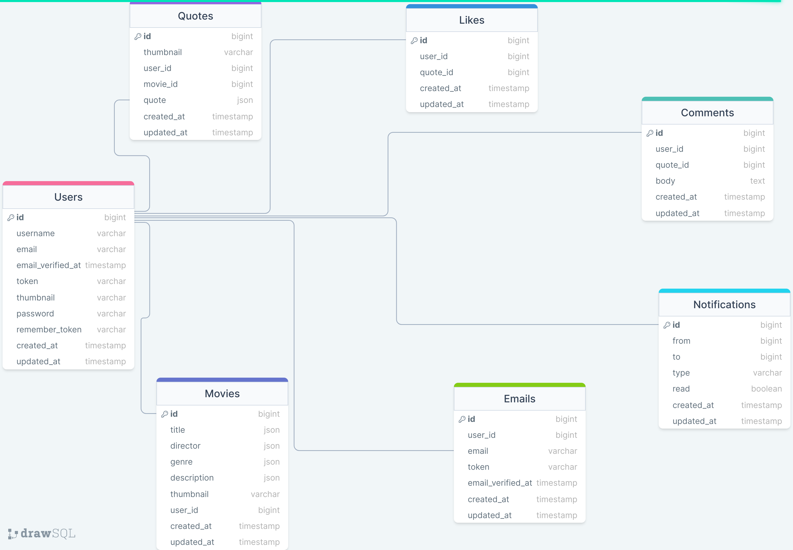

## About Project

Epic-movie is an and interactive web application where you can add your favourite movies and it's quotes. at first you must add a movie, then it's quotes. you have to fill all mandatory fields in english and georgian languages. website is bilingual.

first of all you must register. for that, you must enter valid crudentials in required fields and then you will recieve verification link on your email. after the succesfully verification, you need to log in on our website and add some movies.

In addition, you can register with a Google account and avoid tediuos steps of authentication.

when your movie will be added, you can see it in your movie list page. after that, you can visit to movie-description page and you have a possibility to edit your movie or delete it. also you have two option, you can add a quote from this page or you can visit to news-feed page and add quote.

after that, you can see quotes on your news feed. you have an opportunity to like or comment quotes in real time. if somebody reacted to your quote, you will see a notification on top right side of a website.

you have your own profile page, where you can change your username,or password. also you can add a secondary email address

on your news feed, you will see search bar where you can find your favourite qutes.

api is written with swagger

### Prerequisites

​

-    *PHP@8.1 and up*
-    _MYSQL@8 and up_
-    _npm@6 and up_
-    _composer@2 and up_

#

### Tech Stack

​

-    [Laravel@8.x](https://laravel.com/docs/6.x) - back-end framework
    ​
-    [Spatie Translatable](https://github.com/spatie/laravel-translatable) - package for translation
    ​

#

### Getting Started

1\. At first, you must clone a repository from github:

```
git clone https://github.com/RedberryInternship/aleksandre-kenchoshvili-epic-movie-quotes-back.git
```

​
2\. Next step is to run _composer install_ for install all php dependencies in project.

```
composer install
```

​
3\. after that, you need to install all the JS dependencies:

```
npm install
```

​
and also:

```
npm run dev
```

in order to build your JS/SaaS resources.
​
4\. Now we need to set our env file. Go to the root of your project and execute this command.

```
cp .env.example .env
```

And now you should provide **.env** file all the necessary environment variables:
​

#

**MYSQL:**

> DB_CONNECTION=mysql
> ​
> DB_HOST=127.0.0.1
> ​
> DB_PORT=3306
> ​
> DB_DATABASE=**\***
> ​
> DB_USERNAME=**\***
> ​
> DB_PASSWORD=**\***
> ​
> ​
> ​
> after setting up **.env** file, execute:

```
php artisan config:cache
```

in order to cache environment variables.
​
4\. Now execute in the root of you project following:

```
  php artisan key:generate
```

Which generates auth key.

#

### Migration

if you've completed getting started section, then migrating database if fairly simple process, just execute:

```
php artisan migrate
```

​

#

​
​

#

### Development

​
You can run Laravel's built-in development server by executing:
​

```
  php artisan serve
```

​
when working on JS you may run:
​

```
  npm run dev
```

it builds your js files into executable scripts.

#

Thats all
​

#

### DrawSQL

 
​
